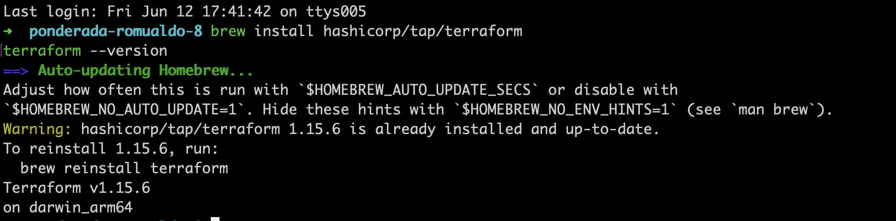
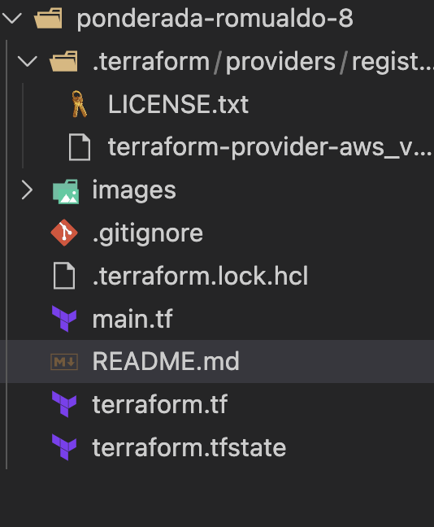
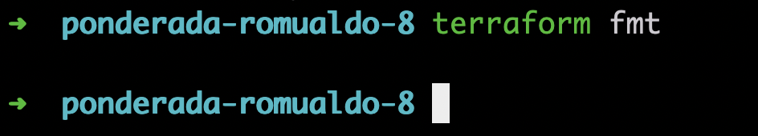
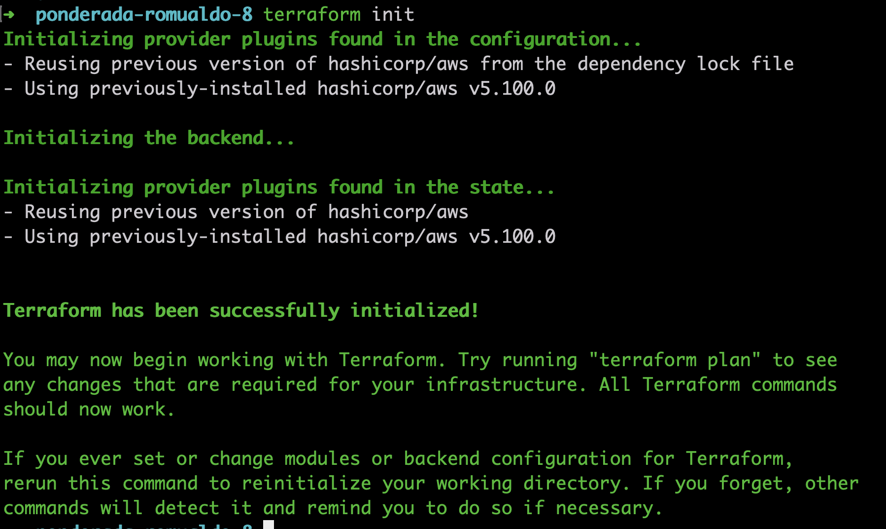
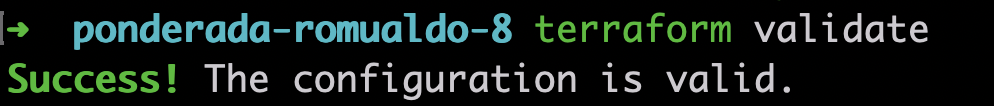
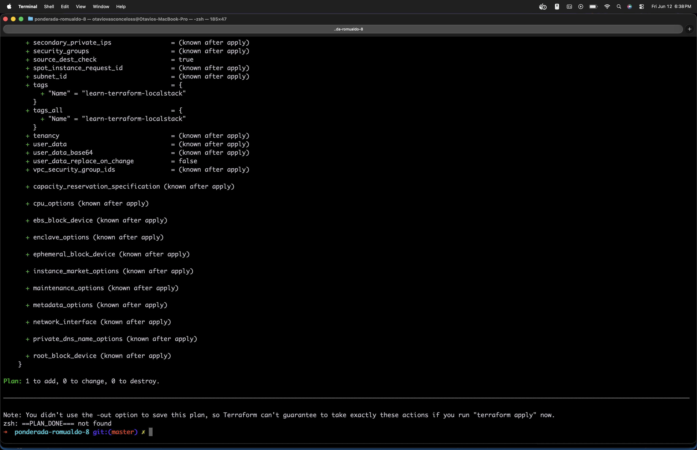
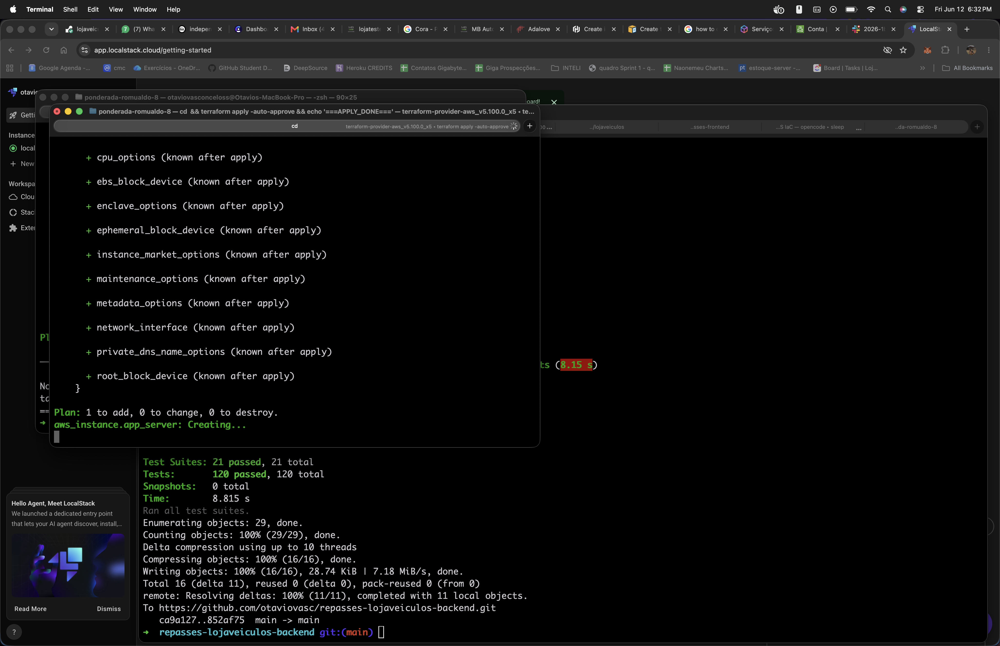
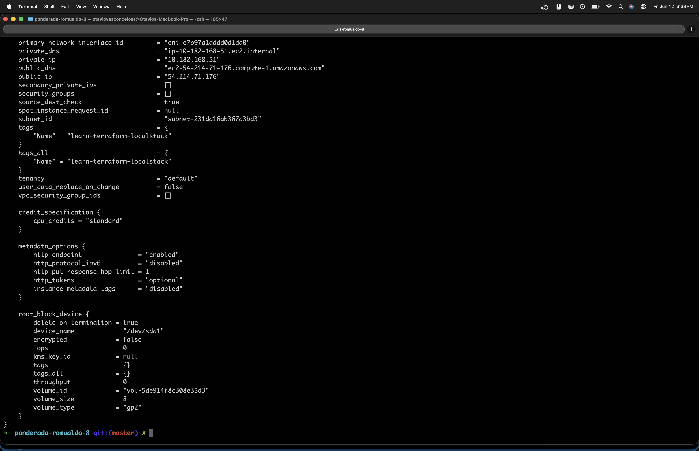

# Terraform + LocalStack — Infraestrutura como Código

Este repositório documenta a execução do tutorial da HashiCorp sobre IaC com Terraform. A diferença: usei LocalStack (emulador AWS via Docker) no lugar da AWS real.

## Por que LocalStack?

Meu usuário IAM (`otavio`) não tinha permissão para EC2. A política `AmazonEC2FullAccess` estava anexada, mas um *permission boundary* bloqueava. Tentei resolver, mas mexer em IAM numa conta de produção é arriscado.

O objetivo do tutorial é aprender Terraform, não debugar políticas IAM. LocalStack entrega a mesma experiência de aprendizado, roda local via Docker, sem custo e sem precisar de credenciais.

## Pré-requisitos

- macOS (arm64)
- Docker v29.2.0
- Terraform v1.15.6 (`brew install hashicorp/tap/terraform`)
- LocalStack (container Docker, não CLI)
- AWS CLI v2.35.3 (instalei mas não usei no fim)

## Passo a Passo

### 1. Instalar Terraform

Instalei via Homebrew e confirmei a versão:

```bash
brew install hashicorp/tap/terraform
terraform --version
```



### 2. Criar arquivos do projeto

Criei três arquivos na raiz:

- `main.tf` — provider AWS apontando pro LocalStack + resource EC2
- `terraform.tf` — versão mínima do Terraform e provider
- `.gitignore` — ignora `.terraform/` e `*.tfstate`

```
ponderada-romualdo-8/
├── main.tf
├── terraform.tf
└── .gitignore
```

O provider usa `endpoints` customizados para `localhost:4566` e pula validações de credenciais. A AMI `ami-12345678` é um mock do LocalStack.



### 3. terraform fmt

Formatei os arquivos `.tf`:

```bash
terraform fmt
```



### 4. terraform init

Baixou o provider AWS v5.100.0:

```bash
terraform init
```



### 5. terraform validate

Checou que a configuração está válida:

```bash
terraform validate
```



### 6. terraform plan

Preview: 1 instância para criar:

```bash
terraform plan
```



### 7. terraform apply -auto-approve

Criou a instância EC2 no LocalStack:

```bash
terraform apply -auto-approve
```



### 8. terraform show

Inspecionei a instância provisionada:

```bash
terraform show
```



## Recursos Provisionados

O que o Terraform criou no LocalStack:

**Instância EC2:**
- Instance ID: `i-d9c09c3d469d02741`
- AMI: `ami-12345678` (mock)
- Tipo: `t2.micro`
- Estado: `running`
- Região: `us-east-1`
- AZ: `us-east-1a`
- Private IP: `10.182.168.51`
- Public IP: `54.214.71.176`
- Tag: `Name = learn-terraform-localstack`

**Infraestrutura gerada automaticamente pelo LocalStack:**
- ENI: `eni-e7b97a1dddd0d1dd0`
- Subnet: `subnet-231dd16ab367d3bd3`
- Volume EBS: `vol-5de914f8c308e35d3` (8 GB gp2)

## Arquivos do Projeto

```
ponderada-romualdo-8/
├── .gitignore
├── .terraform/              # Provider plugins (não versionado)
├── .terraform.lock.hcl
├── main.tf
├── terraform.tf
├── terraform.tfstate        # Estado (não versionado)
├── images/                  # Screenshots dos passos
└── README.md
```

## Problemas que Encontrei

### 1. Permissão IAM na AWS real

Tentei rodar contra a AWS real de primeira. Recebi `UnauthorizedOperation` — meu usuário `otavio` não podia fazer `ec2:DescribeInstanceTypes`. Anexei `AmazonEC2FullAccess` direto, mas ainda falhou por causa de um permission boundary.

Solução: trocar pra LocalStack. Resolveu na hora, sem mexer em IAM.

### 2. LocalStack não subia com `localstack start`

O comando `localstack start` falhou no macOS com erro de virtiofs:

```
Error: failed to create shim task: OCI runtime create failed
```

Solução: rodar o container direto com `docker run` em vez do CLI:

```bash
docker run --rm -d --name localstack \
  -p 4566:4566 -p 4510-4559:4510-4559 \
  localstack/localstack:latest
```

## Limpeza

```bash
terraform destroy -auto-approve
docker stop localstack
```

## Referências

- [HashiCorp — AWS Get Started Tutorial](https://developer.hashicorp.com/terraform/tutorials/aws-get-started/aws-create)
- [LocalStack Documentation](https://docs.localstack.cloud/overview/)
